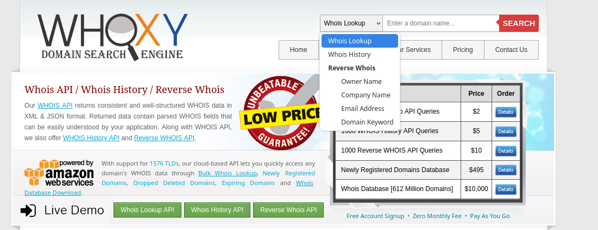

## What is WHOIS
**WHOIS Lookup** is a query made to find registered information about a domain name (domain name) or IP address.
This information usually includes:

- Domain owner (Registrant) information
- Registration date, last update date and expiration date
- Registrar (registrar) it is registered with
- Nameserver (DNS) information
- Admin and technical contact information

During network enumeration, you can find out the following information about the target by performing a WHOIS query:

- Company name
- Contact emails (sometimes you can reach people directly)
- Subdomains or other connected domains
- IP blocks or owned subnets

> some government domains' whois record may be blocked

## Example WHOIS record

    Domain Name: EXAMPLE.COM
    Registry Domain ID: 2336799_DOMAIN_COM-VRSN
    Registrar WHOIS Server: whois.iana.org
    Registrar URL: http://res-dom.iana.org
    Updated Date: 2023-08-14T07:01:23Z
    Creation Date: 1995-08-14T04:00:00Z 
    Registry Expiry Date: 2024-08-13T04:00:00Z 
    Registrar: Internet Assigned Numbers Authority 
    Registrar IANA ID: 376 
    Registrar Abuse Contact Email: abuse@example.com 
    Registrar Abuse Contact Phone: +1.5555555555 
    Domain Status: clientTransferProhibited 
    Name Server: A.IANA-SERVERS.NET 
    Name Server: B.IANA-SERVERS.NET 
    DNSSEC: unsigned 

    Registrant Organization: Internet Corporation for Assigned Names and Numbers 
    Registrant State/Province: CA 
    Registrant Country: US 

    Admin Email: admin@example.com 
    Tech Email: tech@example.com

## Reverse WHOIS
With this method, you can use a name, email, phone number or address to view all information associated with that information. you find domains.

#### What is it good for?

    You can find other sites that the company keeps secret.
    It opens a wide attack surface.
    You can find old projects, forgotten subdomains, etc.

#### Tools/Sites:

    securitytrails.com
    whoxy.com
    domaintools.com (sometimes requires premium)

