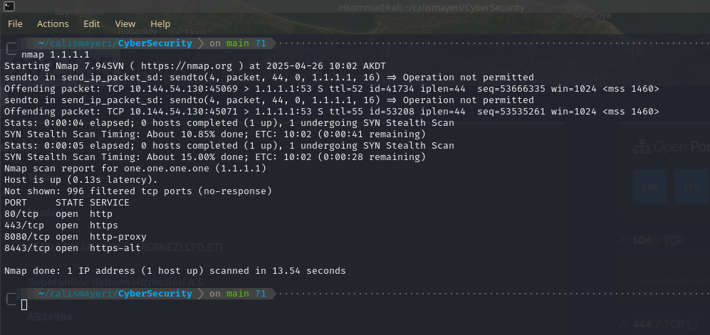
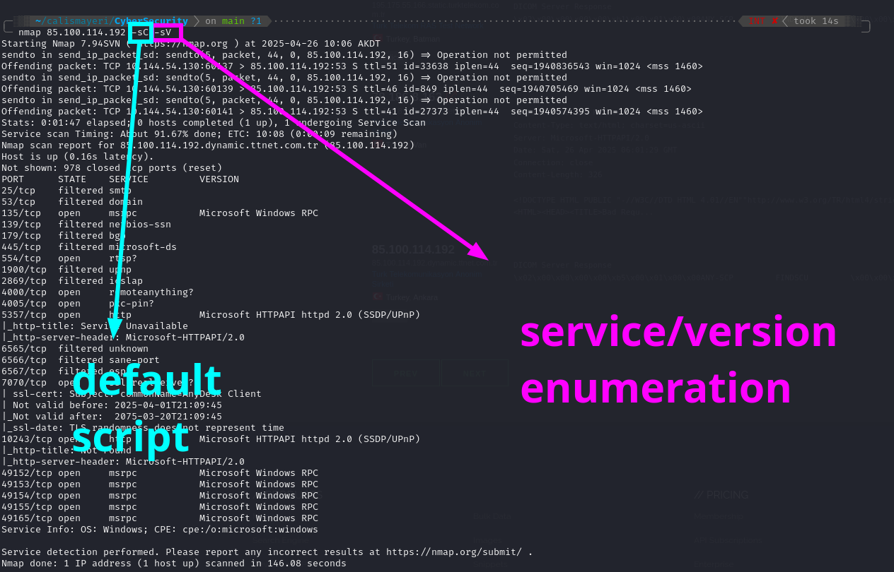
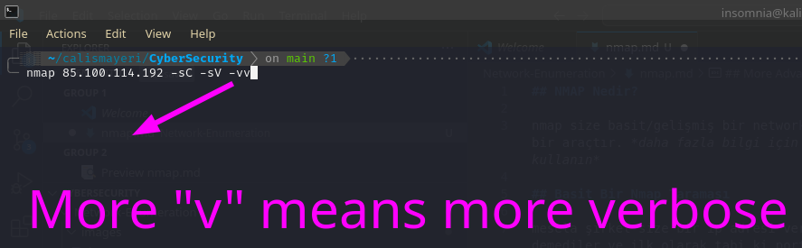
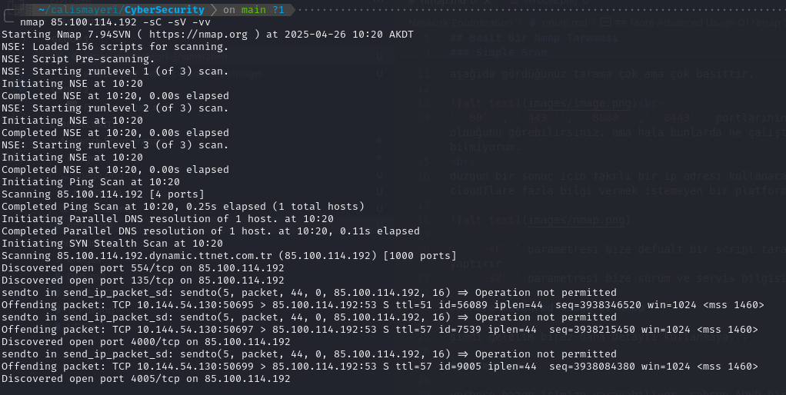

## What is NMAP?

nmap is a tool that allows you to do simple/advanced network analysis. *For more information use the command ```man nmap```*

## A Simple Nmap Scan

For example, the company gave you an IP address, they didn't tell you anything else, and of course you would do a port scan first.

### Simple Scan

The scan you see below is very, very simple.

<br>
You can see that the ports ```80```,```443```,```8080```,```8443``` are open. but I still don't know what's running on them.

<br>
I will use a different IP address for a proper result. Because cloudflare is a platform that doesn't like to give too much information.



- The ```-sC``` parameter makes us perform a default script scan
- The ```-sV``` parameter gives us version and service information.

## More Advanced Usage Of Nmap

Now let's use it in more detail...

### Verbose

verbose can sometimes be useful. Personally, since I have ADHD, I get annoyed when I don't see any output on the screen.




### UDP Enumeration

UDP scans are **REALLY** very slow. I recommend using separate programs like RustScan to speed this up.

<br>

```nmap 85.100.114.192 -sC -sV -sU``` gives you the UDP ports.

### Scanning all ports

You can use the parameter ```-p-``` to scan all ports. To scan specific ports, you can use a parameter like ```-p 80,22,604,139,445``` or if you want to scan a range of ports, you can use a parameter like ```-p 1-5000```.

### Firewall/IDS evasion

You can find it here. I really need to explain it in detail if I do. But if you want me to explain it, contact me. <br>

https://nmap.org/book/man-bypass-firewalls-ids.html