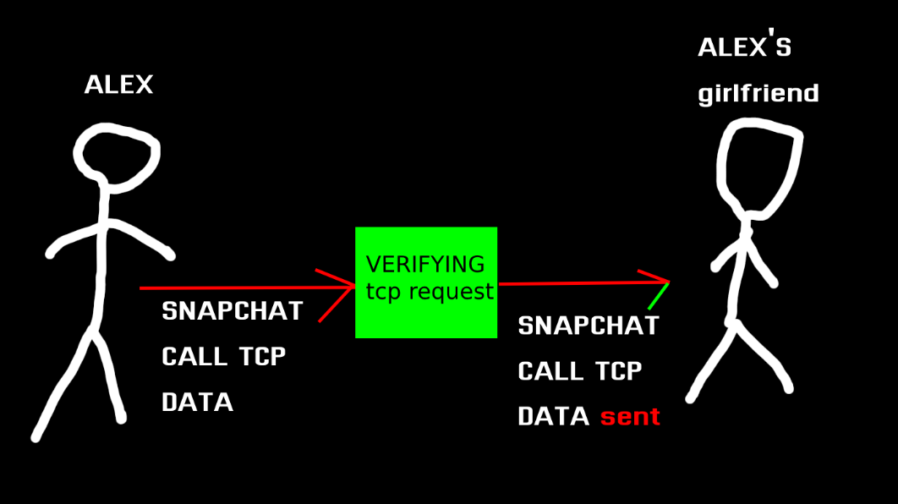

# TCP/IP for dummies

in this markdown, i will explain what's tcp and ip are.

## TCP (Transmission Control Protocol)

bu protokol bilgisayarlar arasında haberleşmeyi sağlar. \
mesela alex snapchat üzerinden kız arkadaşı ile görüşmek istiyor. kız arkadaşını aradığında ona TCP paketi gönderir ve kız arkadaşı bu TCP paketini alır. telefonu açtığında ise kız arkadaşı ona TCP gönderir.    

bu tcp paketleri küçük boyutlarda gönderilir ve kayıp olmadan hedef sisteme paketi iletir.    

bunlar tcp protofolü kullanan bazı yan sanayi protokoller

- HTTP
- HTTPS
- POP3
- SSH
- SMTP
- TELNET
- FTP

daha fazlası için ISO modeli hakkında olan markdown'unumuzu okuyun.

## TCP Protokolü nasıl çalışır?

bunu 3 aşama olarak yapar. örnek senaryo verecek olursam

**1. aşama**: veriyi gönderme
**2. aşama**: veriyi doğrulama
**3. aşama**: verinin gönderilmesi (STATE)

## TCP Bağlantısı Nasıl Kurulur?

TCP’de bu üç ana aşamanın gerçekleşmesi için bazı ara durumlar da gerçekleşmektedir. Bu ara durumlar aşağıdaki gibi sıralanmaktadır.

### LISTEN

Sunucu tarafından bir TCP bağlantı isteğinin beklenildiği durumdur. Dinleme modu olarak adlandırılır.

### SYN-SENT

Karşı tarafa TCP bağlantısı isteği gönderildikten sonra karşı taraftan bağlantı isteğine cevap verilmesi beklenilen durum olarak adlandırılır.

### SYN-RECEIVED

SYN bayrağı ile yapılan bağlantı isteğine sunucunun SYN-ACK bayrağı ile cevap vermesi aşamasından sonraki bekleme durumu olarak adlandırılır.
### ESTABLISHED

Bağlantı kurulduktan sonra gelen veri transferinin yapıldığı durumdur.
### FIN-WAIT-1

Sunucu ve istemci tarafındaki bekleme durumudur.
### FIN-WAIT-2

Karşı taraftan TCP bağlantısının bitirilme isteğinin beklendiği durumdur.
### CLOSE-WAIT

Sunucu ve istemci tarafından bağlantı kapatma talebinin beklendiği durumudur.
### CLOSING

Karşı tarafa bağlantının bitirilmesine dair bir ACK bayrağı gönderildikten sonra bağlantının bitmesini bekleme durumu olarak adlandırılır.
### LAST-ACK

Sunucu ve istemci tarafında ACK beklendiği durumdur.
### TIME-WAIT

Bekleme durumudur.

### CLOSED

TCP bağlantısının tamamen bittiği durum olarak adlandırılır.

------

## IP nedir?

kısaca Internet Protokolüdür.    

IP çalışma mantığında TCP veri paketinin izleyeceği yol belirlenir. Bu işlem yapılırken de TCP katmanından gelen veri paketine kendi SEGMENT başlığını ekler.

