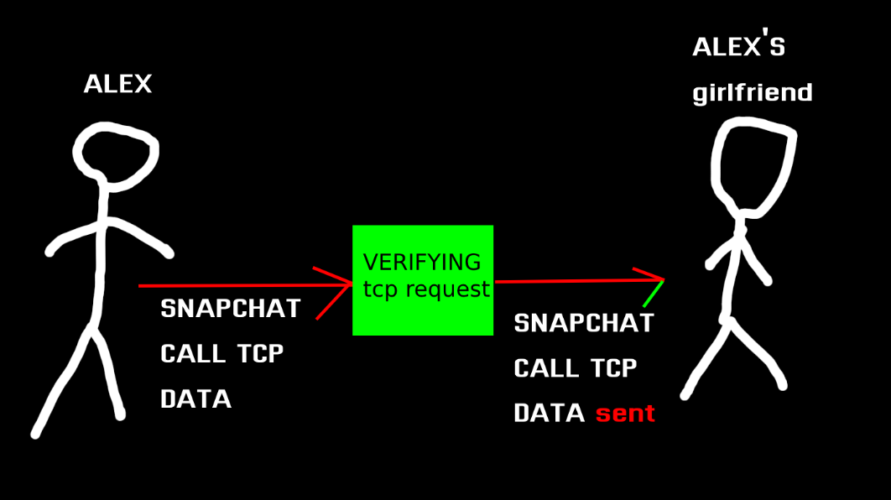

## TCP (Transmission Control Protocol)
this protocol provides communication between computers. \
for example alex wants to talk to his girlfriend on snapchat. when he calls his girlfriend he sends her a TCP packet and she receives this TCP packet. when he answers the phone his girlfriend sends him a TCP.    
these tcp packets are sent in small sizes and transmit the packet to the target system without any loss.    
these are some of the sub-industry protocols that use tcp protocol
- HTTP
- HTTPS
- POP3
- SSH
- SMTP
- TELNET
- FTP
for more read our markdown about the ISO model.
## How does TCP Protocol work?
it does this in 3 stages. if i give an example scenario

**1st Stage**: sending the data
**2nd stage**: verifying the data
**3rd stage**: sending data (STATE)
## How is a TCP Connection Established?
In TCP, there are some intermediate conditions for the realization of these three main stages. These intermediate states are listed as follows.
#### LISTEN
This is when a TCP connection request is expected by the server. It is called listening mode.
#### SYN-SENT
This is the state in which a TCP connection request is sent to the other party and the other party is expected to respond to the connection request.
### SYN-RECEIVED
It is called the waiting state after the server responds to the connection request made with the SYN flag with the SYN-ACK flag.
### ESTABLIS
