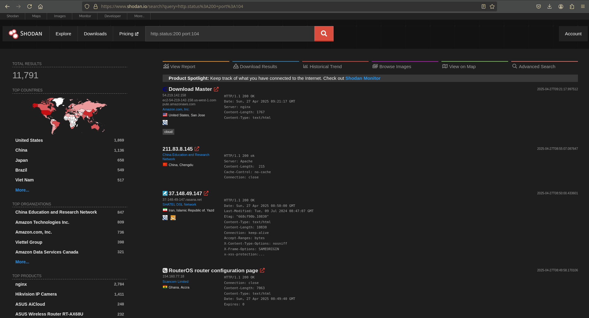
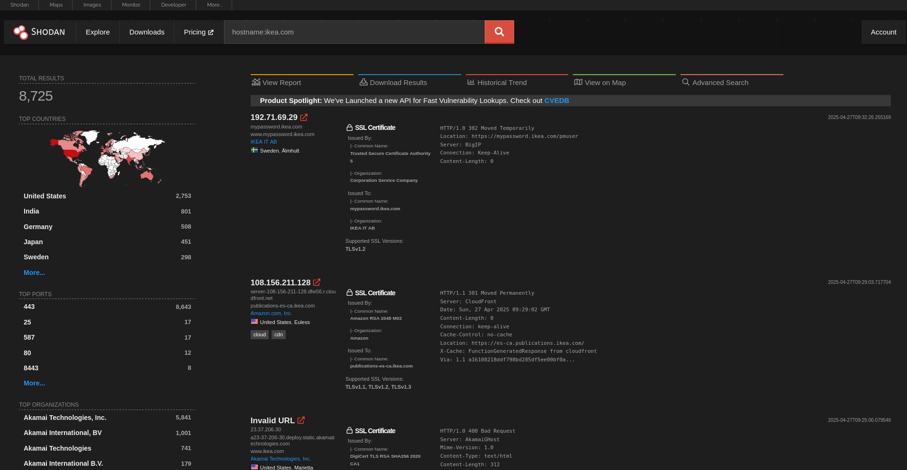
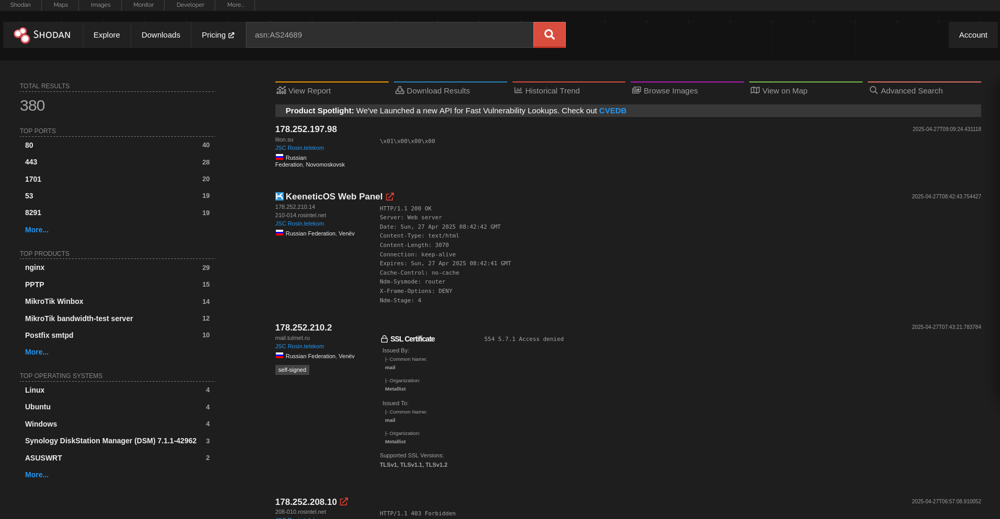
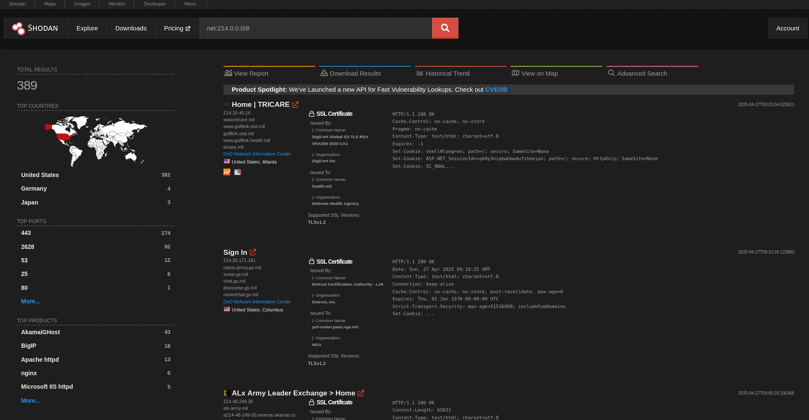

## What is Shodan?
Shodan lets you find open **ports**, **technologies** and current **possible CVE numbers** for a specific IP address.
## Shodan Dorks
You can access all Shodan Dorks here. \
[Search Query Examples](https://www.shodan.io/search/examples)
<br> <br>
For example, hospitals use DICOM for services with port number 104. This is something like an MRI system. If we want to filter with both 200 Status Code and DICOM, we need to enter the following query.

"**```http.status:200 port:104 ```**" \

<br><br>
as you can see here, we found 11,000+ IP addresses.
## RULE 1: Don't Be A Skid
Don't use it in shodan just for your *low level illegal activities* (?). For example, you don't need to go and get a bunch of IP addresses with vulnerable port numbers and pwn them for nothing.
## Some Search Examples

### A specific hostname
**```hostname:example.com```** \


### ASN address
**```asn:AS-NUMBER```** \


### Subnet
**```net:<ipaddress>/<range>```**

